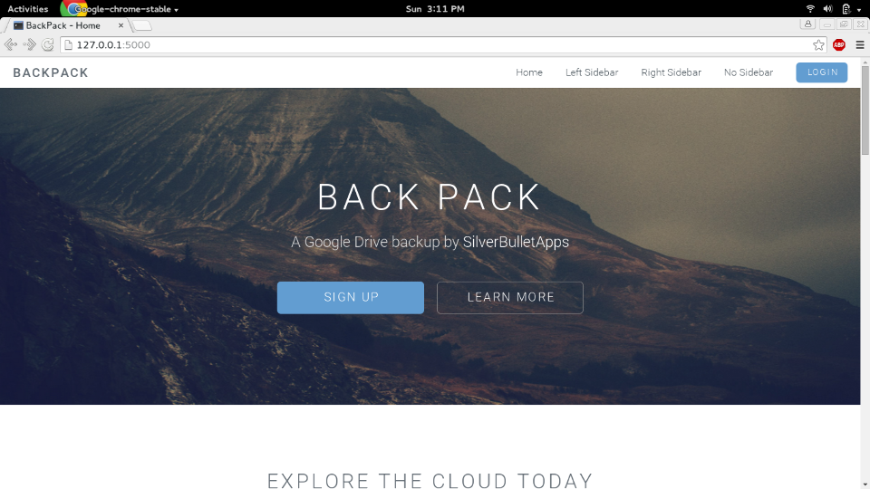
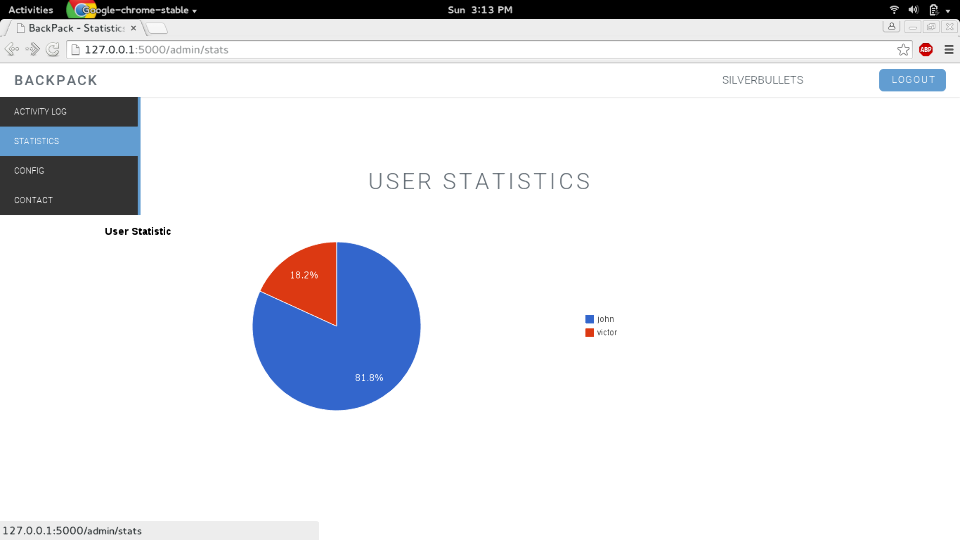
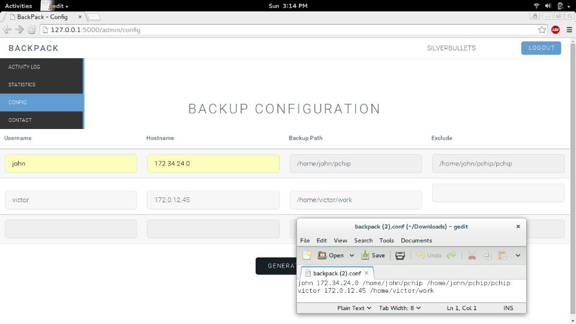
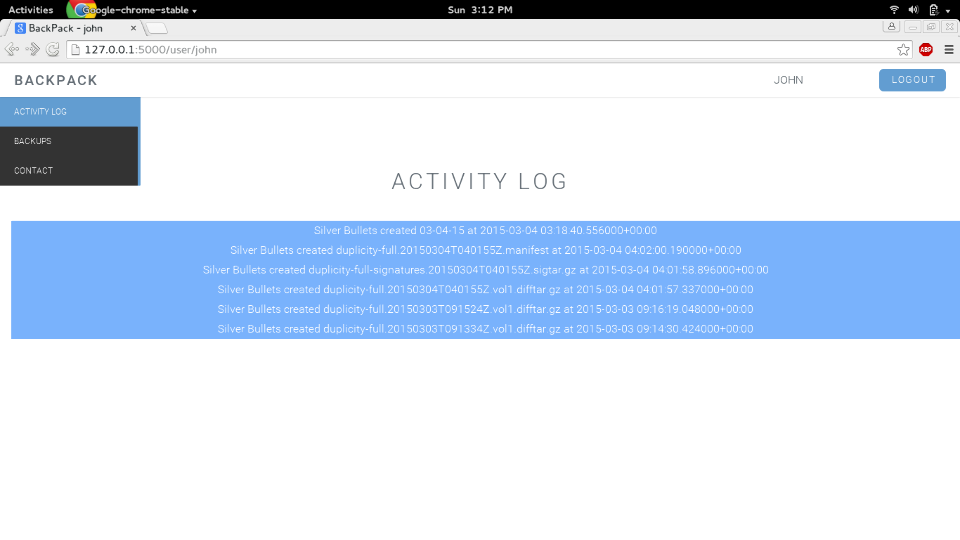
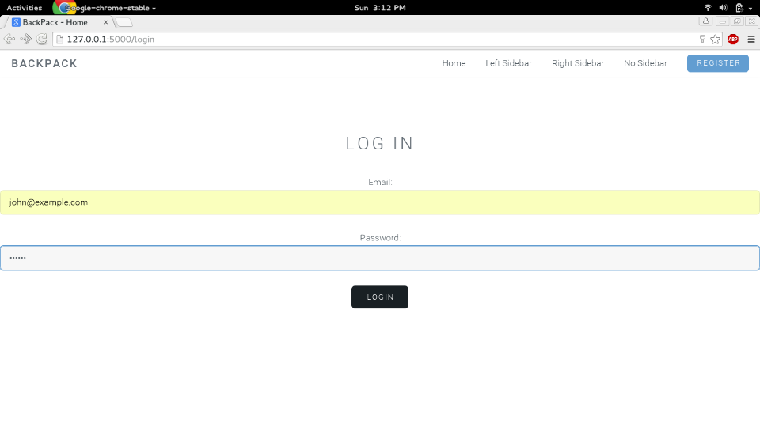

BackPack
=========
An automatic cloud backup and restoration service made using duplicity and Google Drive API.
Files and encrypted, tarred, and pushed to Drive where they can be accessed through a service account for an admin's users.

This project was done using:
 - Crontab scheduling.
 - ssh to connect through server machine in a NAT network to user machines.
 - bcrypt for encryption.
 - Flask as the web framework.
 - Google Drive API to backup files.
 - Vagrant in order to setup VMs for testing

Screenshots
===========

 
